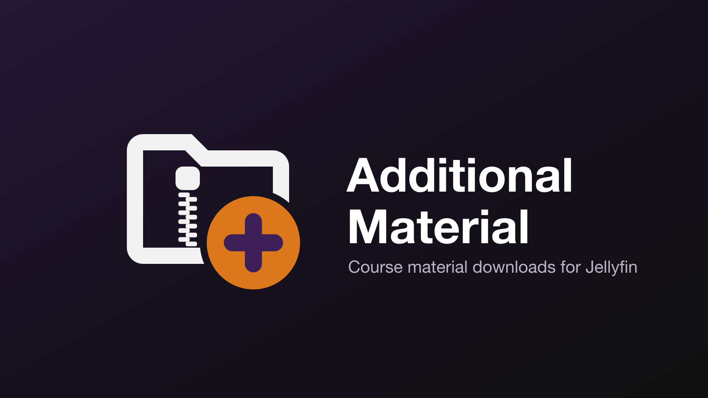

# Additional Material for Jellyfin



Adds an **Additional material** download button to courses, sections and lessons (series,
seasons and episodes, and movies) that have a matching `.zip` stored beside them. It's for
training and coursework libraries, where the videos come with PDFs, lab files, slides and notes
that Jellyfin otherwise ignores.

- Jellyfin **12.1** (built against `Jellyfin.Controller` 12.1.0, .NET 10)
- Opt-in per library
- Downloads honor Jellyfin's own **Allow media downloading** permission and library access
- A helper script builds the archives from the files already stored with your videos


## Building archives (optional)

Turn on **Settings → Building → Build archives from the files stored with the videos** and the
plugin makes the archives itself, with the helper script's rules, instead of you running the
script. After each library scan (and at startup) it works out, per course, what would go where:

- files that belong to one lesson go into that lesson's archive, the rest of a section's into the
  section's, the rest into the course's; a course with folders that hold material but no videos is
  packaged as one archive;
- programs, scripts and documents with macros, embedded objects or PDF JavaScript are replaced by
  a note saying why, with the file's SHA-256;
- adverts, shortcuts and links pointing outside the library are left out (the contents view lists
  them, with the reason: to everyone, administrators only, or nobody).

Icons and contents show at once. The archives are built in the background (or, if you prefer, on
first download), **beside the videos**, where the script would put them, or in the plugin's cache
when that folder cannot be written, or always in the cache if you choose. They are rebuilt when
their files change and removed when they are no longer needed; **Tools → Rebuild built
archives** rebuilds them all. Material that is a single file is handed out as that file, unless
it is large (100 MB by default) and compresses well.

The plugin never touches archives it did not build: **a course that already has archives**
(made by hand or by the script) **is left exactly as it is.**

## What users see

- **Lesson (episode or movie) pages:** the Additional Material button opens **Contents**, a file
  tree of the lesson's archive. Every file has its own Download button; **Download all (.zip)**
  downloads the archive.
- **Course and section pages:** the button downloads that level's archive directly, and a
  **Contents** button lists every archive below, grouped by section, each expandable to its files.
- **Grid cards and list rows:** a small icon; clicking it opens the listing.
- Zips inside an archive are listed too, and their files downloadable (a setting).
- Without the Download permission, users see the contents with the download buttons disabled.

## How it finds material

The plugin looks for a `.zip` with a fixed name. It keeps a small in-memory index of which folders
hold zips, built at startup and after every library scan, so pages and icons never wait for a
sleeping disk to spin up. Nothing is written to Jellyfin's database. A zip added between scans
shows up when its folder's entry is next re-checked (in the background, when a page uses an entry
older than 10 minutes) or at once if you run **Scheduled Tasks → Refresh additional material**.
Downloads always check the file itself.

| Where the zip is | Button appears on |
|---|---|
| `additional-material.zip` in a series (course) folder | the series |
| `additional-material.zip` in a season (section) folder | that season |
| `<video file name>.material.zip` beside a video | that episode or movie |

For example:

```
Training/
  CCNA 200-301 Course/
    additional-material.zip                   ← course
    5 - OSPF/
      additional-material.zip                 ← section
      1 - Introducing OSPF.mp4
      1 - Introducing OSPF.material.zip       ← lesson
```

Only `.zip` is recognized in this version.

**Where the icon appears:**

- **Item pages,** next to Play. On a lesson it downloads that lesson's zip. On a course or section
  it shows how many zips are at or below it, and opens a **listing grouped by section**, with
  *Go to lesson* and *Download* on each row.
- **Grid views:** on each card's top-right corner, after the unwatched count. Clicking it opens
  the same listing without opening the item.
- **List views:** beside the favorite heart.

## Installing

Additional Material needs one other plugin, **File Transformation**, to put its button into the
web client. Both install from the catalog once their repositories are added.

1. In Jellyfin, go to **Dashboard → Plugins → Repositories** and add both repositories (**Add**,
   then name and URL, once for each):

   | Name | URL |
   |---|---|
   | `4o66` | `https://raw.githubusercontent.com/4o66/JellyfinPluginManifest/main/manifest.json` |
   | `File Transformation` | `https://www.iamparadox.dev/jellyfin/plugins/manifest.json` |

   The second is File Transformation's own repository, as its
   [README](https://github.com/IAmParadox27/jellyfin-plugin-file-transformation) gives it.
   Skip it if it is already there: other web plugins (Home Screen Sections, Plugin Pages and
   more) use the same one.
2. Open **Dashboard → Plugins → Catalog** and install **File Transformation**, then
   **Additional Material**. Neither needs configuring to start.
3. Restart Jellyfin.
4. Open **Dashboard → Plugins → Additional Material** (also in the dashboard sidebar), tick the
   libraries that hold course material, and save.

Without File Transformation, everything else still works and the download API stays available,
but no button is shown in the web client.

To install by hand instead, download the zip from
[Releases](https://github.com/4o66/jellyfin-plugin-additional-material/releases), unpack it into a
folder named `Additional Material_<version>` in Jellyfin's `plugins` directory, and restart
Jellyfin. (Install File Transformation the same way, from its own releases.)

## Configuring

Dashboard → Plugins → **Additional Material** (also in the dashboard sidebar). Settings are in
sections; **Save** at the bottom saves every section and shows when there are unsaved changes.

- **General**
  - **Libraries:** the libraries the plugin looks in. None are enabled by default.
  - **Require the "Allow media downloading" permission** (on by default): users without it see
    the download buttons disabled.
  - **Download link lifetime:** how long a download has to start after the button is pressed
    (default 10 minutes).
- **Appearance**
  - **Show material from lower levels on:** only the item it belongs to, its section too, or its
    section and course (default).
  - **Show the icon on cards in grid views** and **on rows in list views** (both on by default).
  - **Button style:** two colors (default), with the plus badge in an accent color you pick, or
    one color that follows the theme. **Reset to default** puts the accent back to Jellyfin's
    `#00A4DC`.
- **Contents**
  - **List the files inside zips that are inside the material** (on by default).
- **Tools** (act at once, no Save needed)
  - **Re-read folders:** re-reads every enabled library's folders now, with progress and the
    result. This also happens after every library scan.
- **About:** the installed version, links, and the repository address with a Copy button.

## Security

- The client only ever sends an **item ID**. The file path is derived from the item, must stay
  inside the library's folders, and symbolic links are refused.
- Every request checks that the user can see the item, the same check Jellyfin uses for its
  own downloads.
- The browser downloads through a **short-lived signed link** (HMAC-SHA256, per user and item),
  so the user's access token never appears in a URL, a proxy log or browser history. Access is
  re-checked when the download starts, so revoking a permission takes effect at once.
- Archives are always sent as attachments (`Content-Disposition: attachment`) with `nosniff`.
  Nothing from an archive is ever displayed in the browser.

## Limits

- **Web client only.** Native apps (Android TV, Roku, Swiftfin, Kodi and so on) don't show the
  button. Clients that wrap the web client (Jellyfin Desktop, Android, webOS) probably do.
- The button is added by script, not by patching the web client's bundles, so a web-client
  update can at worst hide it until the plugin is updated. Downloads keep working.

## The helper script

`tools/make_additional_material.py` builds the archives from the files stored with your
videos. It needs Python 3.11 or newer and nothing else.

```zsh
# See what it would do (nothing is written without --apply):
python3 tools/make_additional_material.py /path/to/Training

# Build them, owned by Jellyfin's user:
python3 tools/make_additional_material.py /path/to/Training --apply --chown 1000:1000
```

Point it at a course folder or at a library folder that holds courses. It follows the structure
of your videos:

1. **Lesson:** a file with the same name as a video, or the same leading lesson number as
   exactly one video in that folder (`4 - Study Plan.pdf` goes with `4 - Welcome.mp4`), or one
   inside `attached_files/<lesson>/`.
2. **Section:** anything else in a season folder.
3. **Course:** files in the course folder itself.

**One archive for the whole course** when it has subfolders that hold material but no videos.
Jellyfin shows no page for those folders, so instead of splitting the course between section
zips and a course zip, everything goes into a single `additional-material.zip` on the course
page, with the folders kept inside. `--package always` does this for every course, and
`--package never` keeps the split.

Videos, subtitles, `.nfo` files, Jellyfin artwork, dot-folders such as `.chapters` and `.url`
shortcuts are always left out. A lone `.zip` that is all of a lesson's material is reused as is
(hard-linked, so it takes no extra space) rather than zipped again.

**Executable and active content is left out by default.** Each such file is replaced in the zip
by `<name>.REMOVED.txt`, a note saying why it was removed, with its SHA-256. Course downloads are
a common way malware spreads.

- **Programs and scripts:** `.exe`, `.dll`, `.msi`, `.bat`, `.ps1`, `.vbs` and similar,
  macro-enabled Office files (`.docm`, `.xlsm`, `.pptm`…), and archives that contain any of them.
  `--allow-executables` includes them.
- **Documents with active content:**
  - Office files with macros, embedded OLE objects, ActiveX controls, external templates, frames
    or OLE links (the route used by CVE-2022-30190 "Follina"), or DDE fields;
  - PDFs with JavaScript, Launch actions, embedded files or RichMedia, including inside
    compressed object streams and `#xx`-obfuscated names;
  - RTF files with embedded objects.

  Ordinary links, embedded charts and images are fine. `--allow-active-documents` includes them.

**Rules for particular sites and downloaders** are kept as small files in `tools/rules/`, one
per rule, each with its own test cases. The built-in rules skip Udemy redirect placeholders
(tiny HTML pages that only send the browser to the website), release-group adverts (by name,
and any text file that is nothing but links), web shortcuts and system files, and chapter
sidecars that Jellyfin plugins write (`*_chapters.xml`). One rule recognizes downloaders'
per-lesson folders (`attached_files/<lesson>/`). `--list-rules` shows them, `--rules DIR` adds
your own, and `--disable-rule ID` turns one off. See [CONTRIBUTING.md](CONTRIBUTING.md) to add
one.

A file that lost its extension (`StudyPlan200301docx`) is named from its content inside the
zip.

**Optional VirusTotal lookups:** with `--virustotal-key KEY` (or `VT_API_KEY`), blocked files
are looked up by SHA-256 and the result is written into the note. Only fingerprints are sent.
`--allow-clean-executables` includes executables that VirusTotal knows and no engine flags.
`--virustotal-upload` also uploads unknown files. **Uploaded files are shared with VirusTotal's
community, so only use it for files you're allowed to share.** The free API allows 4 requests a
minute; the script waits accordingly.

Other options include `--levels lesson,section,course`, `--match name`, `--exclude GLOB`,
`--only COURSE`, `--update`, `--force`, `--compression store` and `--json report.json` for
automation. See `--help`.

On a host without Python (Unraid, for example), run it in a throwaway container:

```zsh
docker run --rm -v /mnt/user/media/Training:/data -v "$PWD/tools:/t:ro" python:3-alpine \
  python /t/make_additional_material.py /data --apply --chown 99:100
```

## Building

```zsh
dotnet publish src/Jellyfin.Plugin.AdditionalMaterial -c Release -o out
```

The output is a single `Jellyfin.Plugin.AdditionalMaterial.dll`. Without a local .NET 10 SDK:

```zsh
docker run --rm -v "$PWD:/src" -w /src mcr.microsoft.com/dotnet/sdk:10.0 \
  dotnet publish src/Jellyfin.Plugin.AdditionalMaterial -c Release -o out
```

## Testing

- `python3 -m unittest discover -s tests`: the helper script (13 tests, including a fake
  VirusTotal server).
- `tests/integration.sh out [file-transformation-plugin-dir]`: starts a throwaway Jellyfin
  12.1 container with sample media and checks lookups, permissions, path safety, signed links,
  downloads, listings, batch lookups and the web injection (46 checks). `tests/integration.sh --cleanup` removes it.
- `tests/browser_test.py`: drives the web client in headless Chromium against that server
  (27 checks): item-page button, listing, grid and list icons, settings page. The command is in the file's header.

## License

[GPL-3.0](LICENSE), like Jellyfin's own plugins.

Copyright (C) 2026 4o66
